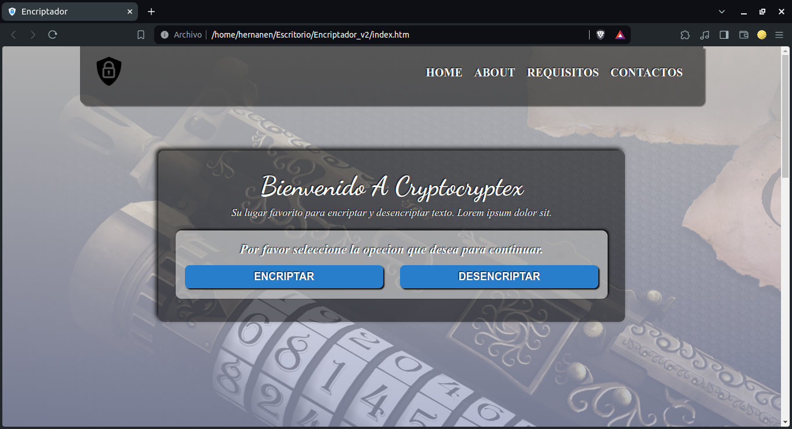
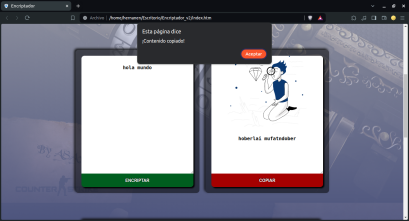
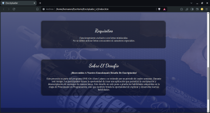
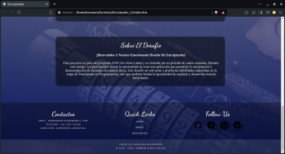
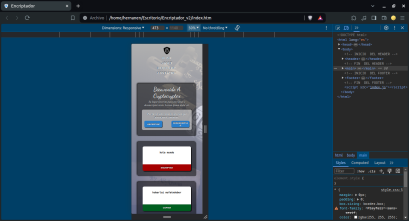
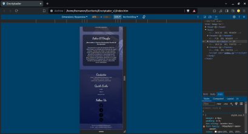
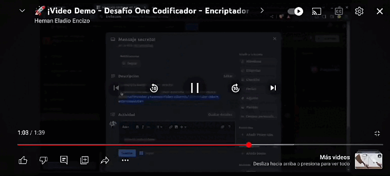

# Encriptador y Desencriptador de Texto

Este proyecto consiste en una aplicación web que permite encriptar y desencriptar texto utilizando un algoritmo simple de sustitución de letras.

## Descripción 📝

La aplicación toma un texto como entrada y lo encripta según las siguientes reglas:

- La letra "a" se convierte en "ai".
- La letra "e" se convierte en "enter".
- La letra "i" se convierte en "imes".
- La letra "o" se convierte en "ober".
- La letra "u" se convierte en "ufat".

Además, permite desencriptar texto encriptado siguiendo el mismo algoritmo.

## Funcionalidades Extras 🚀

Como funcionalidades adicionales, hemos implementado:

- Un botón que copia el texto encriptado/desencriptado al portapapeles.
- La funcionalidad de copiado equivale a la combinación de teclas "Ctrl+C" o la opción "copiar" del menú de las aplicaciones.

## Visuales 👀









### Video Demo 👇

- Haga click en el gif y será direccionado...

[](https://youtu.be/Cnp1XvuUUnU)

## Pre-requisitos 📋

Asegúrate de tener instalado lo siguiente:

- Navegador web moderno (Chrome, Firefox, Edge, etc.)
- Conexión a internet

## Empezando 🏁

Para obtener una copia de este proyecto, simplemente clona este repositorio utilizando Git en tu terminal:

```bash
git clone https://github.com/Hernanencizo360/Encriptador_Alura.git
```

También puedes descargar el proyecto en formato ZIP haciendo clic en el botón "Code" en la parte superior de esta página y seleccionando "Download ZIP".

Una vez que tengas el proyecto en tu máquina local, puedes abrir el archivo index.html en tu navegador web para ver la aplicación en funcionamiento.

## Construido Con 🛠️

- 
- 
- 

## Hoja de Ruta 🗺️

Ideas, mejoras planificadas y actualizaciones futuras para el proyecto.

### Próximos Pasos

1. **Pulir el código:** Mejorar la legibilidad, organización y estructura del código para que sea más limpio y mantenible.
2. **Mejorar el responsive:** Ajustar los estilos y tamaños para garantizar una experiencia consistente en diferentes dispositivos y tamaños de pantalla.
3. **Agregar un botón de pegado:** Implementar un botón que permita al usuario pegar el contenido copiado, junto con todas las funcionalidades necesarias para su correcto funcionamiento.
4. **Facilitar el cambio de encriptar a desencriptar:** Hacer que la transición entre encriptar y desencriptar sea más intuitiva y sencilla para el usuario.

## Versionado 📌

Usamos [Git](https://git-scm.com) para el control de versiones. Puedes revisar el historial de commits en este repositorio para ver las diferentes versiones del proyecto.

## Soporte 🤝

Si tienes algún problema o sugerencia, por favor abre un problema [aquí](https://github.com/Hernanencizo360/Encriptador_Alura/issues).

## Autores ✒️

- **[Hernán Eladio Encizo](https://github.com/Hernanencizo360)** - _Trabajo inicial_

## Links 🔗

[](https://github.com/Hernanencizo360)
[](https://t.me/hernanencizo360)
[](https://www.instagram.com/hernanencizo360)
[](https://www.linkedin.com/in/hern%C3%A1n-encizo-b3b355229?original_referer=)

## Licencia 📄

Este proyecto está bajo la Licencia MIT. Consulta el archivo [LICENSE.md](LICENSE.md) para más detalles.
